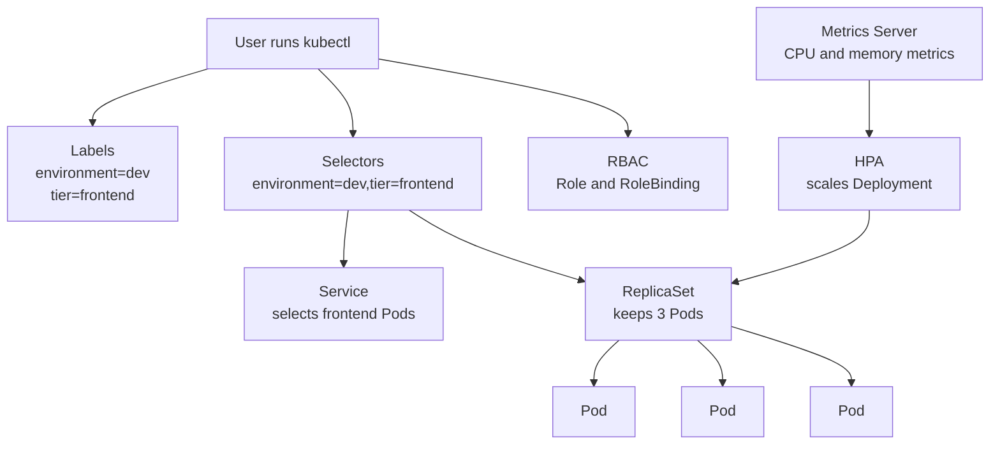

# Day 4 - Labels, Selectors, ReplicaSet, Autoscaling, Metrics Server, And RBAC

## Goal

Day 4 is a practical deep dive into how Kubernetes identifies resources, keeps replicas running, scales workloads, and controls permissions.

By the end of this module, you should be able to:

- Add useful labels to Pods.
- Filter Kubernetes resources using equality-based selectors.
- Filter Kubernetes resources using set-based selectors.
- Understand how Services use selectors to find Pods.
- Create and test a ReplicaSet.
- Understand why Deployments are normally preferred over direct ReplicaSets.
- Enable Metrics Server in Minikube.
- Create a HorizontalPodAutoscaler.
- Generate load and watch HPA scale Pods.
- Create basic RBAC permissions using Role and RoleBinding.
- Test permissions using `kubectl auth can-i`.
- Understand ClusterRole and ClusterRoleBinding at a basic level.

## Big Picture

```text
Labels identify resources.
Selectors find resources.
ReplicaSet maintains Pod count.
HPA changes Pod count based on metrics.
RBAC controls who can do what.
```

Day 4 connects several real Kubernetes ideas:

```text
Labels + Selectors ---> Services, ReplicaSets, Deployments, NetworkPolicies
ReplicaSet ----------> Self-healing Pods
Metrics Server ------> CPU and memory metrics
HPA -----------------> Automatic Pod scaling
RBAC ----------------> Access control
```

## Architecture Diagram



## Day 4 File Structure

```text
day4/
|-- README.md
|-- labeled-pods.yaml
|-- ecommerce-frontend-service.yaml
|-- nginx-replicaset.yaml
|-- php-apache-deployment.yaml
|-- php-apache-service.yaml
|-- php-apache-hpa.yaml
|-- dev-user-serviceaccount.yaml
|-- pod-reader-role.yaml
|-- pod-reader-rolebinding.yaml
|-- node-reader-clusterrole.yaml
|-- node-reader-clusterrolebinding.yaml
```

## Namespace

All namespace-scoped objects in this module use:

```text
day4
```

Create the namespace:

```powershell
kubectl create namespace day4
```

Set it as the current namespace for this terminal:

```powershell
kubectl config set-context --current --namespace=day4
```

This is optional but useful. Even if you set the context, the commands below still include `-n day4` where clarity is useful.

## 1. Labels

Labels are key-value pairs attached to Kubernetes objects.

Labels can be added to:

- Pods
- Services
- Deployments
- ReplicaSets
- Nodes
- Namespaces

Example:

```yaml
labels:
  app: ecommerce
  environment: dev
  tier: frontend
```

Simple meaning:

```text
Labels are tags used to identify and group Kubernetes resources.
```

Real project examples:

```text
environment=dev
environment=qa
environment=prod

tier=frontend
tier=backend

app=payment
app=orders
app=cart
```

If a project has DEV, QA, and PROD workloads in the same cluster, labels help filter the correct resources quickly.

Example:

```powershell
kubectl get pods -l environment=prod
```

Meaning:

```text
Show Pods where environment is prod.
```

## 2. Selectors

Selectors are used to find resources by labels.

Simple meaning:

```text
Labels are attached to resources.
Selectors search for matching labels.
```

Example Pod label:

```yaml
labels:
  app: ecommerce
  tier: frontend
```

Example Service selector:

```yaml
selector:
  app: ecommerce
  tier: frontend
```

Meaning:

```text
The Service sends traffic to Pods where app=ecommerce and tier=frontend.
```

## Why Labels And Selectors Are Important

| Kubernetes Object | Why It Uses Labels And Selectors |
| --- | --- |
| Service | Finds matching Pods and sends traffic to them |
| ReplicaSet | Knows which Pods it should manage |
| Deployment | Manages ReplicaSets and Pods through selectors |
| kubectl | Filters resources in command output |
| NetworkPolicy | Selects Pods for network rules |
| HPA | Scales a target workload that manages labeled Pods |

Important production idea:

```text
A Service does not manually store Pod IPs.
It selects Pods by labels.
```

AWS analogy:

```text
Kubernetes Service selector is similar to an AWS ALB target group selecting healthy targets.
```

## 3. Equality-Based Selectors

Equality-based selectors compare label keys and values.

Supported operators:

```text
=
==
!=
```

Examples:

```powershell
kubectl get pods -l environment=dev -n day4
kubectl get pods -l environment==dev -n day4
kubectl get pods -l tier!=frontend -n day4
```

Meaning:

```text
environment=dev  ---> select resources where environment is dev
tier!=frontend   ---> select resources where tier is not frontend
```

Multiple conditions:

```powershell
kubectl get pods -l environment=dev,tier=frontend -n day4
```

Meaning:

```text
Show Pods where environment=dev and tier=frontend.
```

Important syntax rule:

```text
Do not add spaces around commas or equal signs in normal selector commands.
```

Wrong:

```powershell
kubectl get pods -l environment=dev, tier = frontend -n day4
```

Correct:

```powershell
kubectl get pods -l environment=dev,tier=frontend -n day4
```

## 4. Set-Based Selectors

Set-based selectors match one or more values.

Supported operators:

```text
in
notin
exists
does not exist
```

Examples:

```powershell
kubectl get pods -l 'environment in (dev,qa)' -n day4
kubectl get pods -l 'tier notin (frontend)' -n day4
kubectl get pods -l 'environment in (prod),tier in (frontend)' -n day4
kubectl get pods -l 'partition' -n day4
kubectl get pods -l '!partition' -n day4
```

Meaning:

```text
environment in (dev,qa)       ---> dev or qa Pods
tier notin (frontend)         ---> Pods where tier is not frontend
partition                     ---> Pods where label key partition exists
!partition                    ---> Pods where label key partition does not exist
```

Important syntax rule:

```text
Use quotes for set-based selectors.
PowerShell and Bash can misread brackets and spaces if quotes are not used.
```

Wrong:

```powershell
kubectl get pods -l environment in (prod), tier in (frontend) -n day4
```

Correct:

```powershell
kubectl get pods -l 'environment in (prod),tier in (frontend)' -n day4
```

## 5. Practical 1 - Labels And Selectors

Apply the labeled Pods:

```powershell
kubectl apply -f day4/labeled-pods.yaml
```

Check all Pods with labels:

```powershell
kubectl get pods -n day4 --show-labels
```

Expected resources:

```text
frontend-dev-pod
backend-dev-pod
frontend-prod-pod
backend-qa-pod
```

Filter only dev Pods:

```powershell
kubectl get pods -n day4 -l environment=dev
```

Filter only frontend Pods:

```powershell
kubectl get pods -n day4 -l tier=frontend
```

Note:

```text
If other applications also use tier=frontend, they will also appear.
Use a more specific selector such as app=ecommerce,tier=frontend when needed.
```

Filter dev backend Pods:

```powershell
kubectl get pods -n day4 -l environment=dev,tier=backend
```

Filter Pods that are not prod:

```powershell
kubectl get pods -n day4 -l environment!=prod
```

Filter dev and qa Pods:

```powershell
kubectl get pods -n day4 -l 'environment in (dev,qa)'
```

Filter Pods where tier is not backend:

```powershell
kubectl get pods -n day4 -l 'tier notin (backend)'
```

Filter prod frontend Pods:

```powershell
kubectl get pods -n day4 -l 'environment in (prod),tier in (frontend)'
```

Filter Pods where `partition` label exists:

```powershell
kubectl get pods -n day4 -l 'partition'
```

Filter Pods where `partition` label does not exist:

```powershell
kubectl get pods -n day4 -l '!partition'
```

## 6. Service Selector Practical

Create a Service that selects only frontend ecommerce Pods:

```powershell
kubectl apply -f day4/ecommerce-frontend-service.yaml
```

Check the Service:

```powershell
kubectl get svc ecommerce-frontend -n day4
```

Check endpoints:

```powershell
kubectl get endpoints ecommerce-frontend -n day4
kubectl get endpointslice -n day4 -l kubernetes.io/service-name=ecommerce-frontend
```

Expected result:

```text
The Service should have endpoints for frontend-dev-pod and frontend-prod-pod.
It should not include backend-dev-pod or backend-qa-pod.
```

Why?

The Service selector is:

```yaml
selector:
  app: ecommerce
  tier: frontend
```

Only Pods with both labels match.

## 7. Replicas And ReplicaSet

## What Is A Replica?

A replica means one running copy of a Pod.

Example:

```yaml
replicas: 3
```

Meaning:

```text
Kubernetes should maintain 3 running Pods.
```

If one Pod is deleted, Kubernetes creates a replacement.

## What Is A ReplicaSet?

A ReplicaSet keeps a stable number of matching Pods running.

Example:

```text
Desired replicas: 3
Current running Pods: 2
ReplicaSet action: create 1 more Pod
```

ReplicaSet flow:

```text
ReplicaSet ---> Pods
```

Important production note:

```text
In real projects, we usually create Deployments instead of direct ReplicaSets.
Deployment manages ReplicaSets and gives rollout and rollback features.
```

## 8. Practical 2 - ReplicaSet

Apply the ReplicaSet:

```powershell
kubectl apply -f day4/nginx-replicaset.yaml
```

Check ReplicaSet:

```powershell
kubectl get rs -n day4
```

Check Pods:

```powershell
kubectl get pods -n day4 -l app=nginx -o wide
kubectl get pods -n day4 -l app=nginx --show-labels
```

Delete one ReplicaSet-managed Pod:

```powershell
kubectl delete pod <nginx-rs-pod-name> -n day4
```

Check Pods again:

```powershell
kubectl get pods -n day4 -l app=nginx -o wide
```

Expected result:

```text
One Pod is deleted.
ReplicaSet creates a new Pod.
Replica count returns to 3.
```

This is Kubernetes self-healing.

## ReplicaSet Selector Warning

The ReplicaSet selector must match the Pod template labels.

Correct:

```yaml
selector:
  matchLabels:
    app: nginx
    tier: frontend
template:
  metadata:
    labels:
      app: nginx
      tier: frontend
```

If the selector and template labels do not match, Kubernetes rejects the manifest.

## ReplicaSet Vs Deployment

| ReplicaSet | Deployment |
| --- | --- |
| Maintains Pod count | Manages ReplicaSets |
| Provides self-healing | Provides self-healing |
| No rollout history by itself | Supports rollout history |
| No easy rollback by itself | Supports rollback |
| Rarely created directly in projects | Commonly used in projects |

Interview answer:

```text
A ReplicaSet maintains the desired number of Pods.
A Deployment manages ReplicaSets and provides rolling updates, rollback, and version management.
```

## 9. Autoscaling

Autoscaling means Kubernetes can automatically increase or decrease capacity based on demand.

Simple meaning:

```text
More traffic  ---> more Pods
Less traffic  ---> fewer Pods
```

Common autoscaling layers:

| Autoscaling Type | Meaning |
| --- | --- |
| Horizontal Pod Autoscaling | Add or remove Pods |
| Vertical Pod Autoscaling | Change CPU/memory requests for Pods |
| Cluster Autoscaling | Add or remove worker nodes |

## Horizontal Pod Autoscaler

Horizontal Pod Autoscaler is called HPA.

HPA scales workloads like:

- Deployment
- StatefulSet
- ReplicaSet

In most real projects, HPA targets a Deployment.

Example:

```text
CPU target: 50%
Current CPU: 90%
HPA action: increase Pods
```

Important:

```text
HPA needs metrics.
For CPU-based scaling, the target container should have CPU requests.
```

Correct command format:

```powershell
kubectl autoscale deployment php-apache --cpu-percent=50 --min=1 --max=10 -n day4
```

Common mistakes:

| Wrong | Correct |
| --- | --- |
| `--cpu-percentage` | `--cpu-percent` |
| `50mb` | `50` |
| `---min` | `--min` |

CPU percentage is a utilization percentage, not memory.

## Vertical Pod Autoscaling

Vertical Pod Autoscaling is called VPA.

VPA changes CPU and memory requests or limits for existing Pods.

Example:

```text
Old memory request: 256Mi
Recommended memory request: 512Mi
```

Beginner note:

```text
Understand VPA conceptually first.
For this class, HPA is the practical demo.
```

## Node-Based Scaling

Node-based scaling increases or decreases worker nodes.

Cloud examples:

- EKS Cluster Autoscaler
- EKS Karpenter
- Managed Node Group scaling
- AKS Cluster Autoscaler
- GKE Cluster Autoscaler

Minikube note:

```text
For this local class, explain node autoscaling conceptually.
Do not perform node autoscaling as part of the beginner lab.
```

## 10. Metrics Server

Metrics Server collects CPU and memory usage from kubelets and exposes it through the Kubernetes Metrics API.

HPA uses this data to make scaling decisions.

Enable Metrics Server in Minikube:

```powershell
minikube addons enable metrics-server
```

Wait for the Metrics Server Pod:

```powershell
kubectl get pods -n kube-system
kubectl get deployment metrics-server -n kube-system
```

Check node metrics:

```powershell
kubectl top nodes
```

Check Pod metrics:

```powershell
kubectl top pods -n day4
```

Check one specific node:

```powershell
kubectl top node <node-name>
```

Check one specific Pod:

```powershell
kubectl top pod <pod-name> -n day4
```

If metrics are not ready immediately, wait one or two minutes and retry.

## 11. Practical 3 - HPA

Apply the HPA demo Deployment:

```powershell
kubectl apply -f day4/php-apache-deployment.yaml
```

Apply the Service:

```powershell
kubectl apply -f day4/php-apache-service.yaml
```

Wait for the Deployment:

```powershell
kubectl rollout status deployment/php-apache -n day4
kubectl get pods -n day4 -l app=php-apache
```

Apply the HPA:

```powershell
kubectl apply -f day4/php-apache-hpa.yaml
```

Check HPA:

```powershell
kubectl get hpa -n day4
kubectl describe hpa php-apache -n day4
```

At first, you may see:

```text
TARGETS   <unknown>/50%
```

This usually means metrics are not ready yet.

Wait and check again:

```powershell
kubectl get hpa php-apache -n day4 -w
```

Generate load from another terminal:

```powershell
kubectl run -i --tty load-generator -n day4 --rm --image=busybox:1.36 --restart=Never -- /bin/sh
```

Inside the BusyBox shell, run:

```sh
while true; do wget -q -O- http://php-apache; done
```

Watch scaling from another terminal:

```powershell
kubectl get hpa php-apache -n day4 -w
kubectl get pods -n day4 -l app=php-apache -w
```

Expected behavior:

```text
CPU usage increases.
HPA increases the Deployment replica count.
More php-apache Pods are created.
```

Stop load generation using `Ctrl+C`.

Scale-down note:

```text
HPA may take several minutes to scale down after traffic stops.
This is normal behavior.
```

## 12. RBAC

RBAC means Role-Based Access Control.

Simple meaning:

```text
RBAC controls who can access what in Kubernetes.
```

RBAC answers:

```text
Who is the user?
What resource can they access?
What action can they perform?
In which namespace?
```

Examples:

```text
Developer can list Pods in dev namespace.
Developer cannot delete Pods in prod namespace.
DevOps admin can manage all namespaces.
```

## Main RBAC Objects

| RBAC Object | Scope | Purpose |
| --- | --- | --- |
| Role | Namespace | Grants permissions inside one namespace |
| RoleBinding | Namespace | Attaches a Role to a user, group, or ServiceAccount |
| ClusterRole | Cluster | Grants cluster-wide permissions or reusable permissions |
| ClusterRoleBinding | Cluster | Attaches a ClusterRole cluster-wide |

## 13. Practical 4 - Namespace RBAC

Apply the ServiceAccount:

```powershell
kubectl apply -f day4/dev-user-serviceaccount.yaml
```

Apply the Role:

```powershell
kubectl apply -f day4/pod-reader-role.yaml
```

Apply the RoleBinding:

```powershell
kubectl apply -f day4/pod-reader-rolebinding.yaml
```

Check objects:

```powershell
kubectl get serviceaccount dev-user -n day4
kubectl get role pod-reader -n day4
kubectl get rolebinding pod-reader-binding -n day4
```

Test list permission:

```powershell
kubectl auth can-i list pods --as=system:serviceaccount:day4:dev-user -n day4
```

Expected:

```text
yes
```

Test delete permission:

```powershell
kubectl auth can-i delete pods --as=system:serviceaccount:day4:dev-user -n day4
```

Expected:

```text
no
```

Meaning:

```text
The dev-user ServiceAccount can read Pods but cannot delete Pods.
```

## 14. Practical 5 - ClusterRole And ClusterRoleBinding

ClusterRole is used for cluster-level permissions.

Apply the ClusterRole:

```powershell
kubectl apply -f day4/node-reader-clusterrole.yaml
```

Apply the ClusterRoleBinding:

```powershell
kubectl apply -f day4/node-reader-clusterrolebinding.yaml
```

Test node list permission:

```powershell
kubectl auth can-i list nodes --as=system:serviceaccount:day4:dev-user
```

Expected:

```text
yes
```

Important:

```text
ClusterRoleBinding is cluster-wide.
Use it carefully in real environments.
```

## Complete Day 4 Command Flow

```powershell
# Namespace
kubectl create namespace day4
kubectl config set-context --current --namespace=day4

# Labels and selectors
kubectl apply -f day4/labeled-pods.yaml
kubectl get pods -n day4 --show-labels
kubectl get pods -n day4 -l environment=dev
kubectl get pods -n day4 -l tier=frontend
kubectl get pods -n day4 -l environment=dev,tier=backend
kubectl get pods -n day4 -l environment!=prod
kubectl get pods -n day4 -l 'environment in (dev,qa)'
kubectl get pods -n day4 -l 'tier notin (backend)'
kubectl get pods -n day4 -l 'environment in (prod),tier in (frontend)'
kubectl get pods -n day4 -l 'partition'
kubectl get pods -n day4 -l '!partition'

# Service selector
kubectl apply -f day4/ecommerce-frontend-service.yaml
kubectl get svc ecommerce-frontend -n day4
kubectl get endpoints ecommerce-frontend -n day4
kubectl get endpointslice -n day4 -l kubernetes.io/service-name=ecommerce-frontend

# ReplicaSet
kubectl apply -f day4/nginx-replicaset.yaml
kubectl get rs -n day4
kubectl get pods -n day4 -l app=nginx -o wide
kubectl delete pod <nginx-rs-pod-name> -n day4
kubectl get pods -n day4 -l app=nginx -o wide

# Metrics Server
minikube addons enable metrics-server
kubectl get deployment metrics-server -n kube-system
kubectl top nodes
kubectl top pods -n day4

# HPA
kubectl apply -f day4/php-apache-deployment.yaml
kubectl apply -f day4/php-apache-service.yaml
kubectl rollout status deployment/php-apache -n day4
kubectl apply -f day4/php-apache-hpa.yaml
kubectl get hpa -n day4

# Load generation, run in a separate terminal
kubectl run -i --tty load-generator -n day4 --rm --image=busybox:1.36 --restart=Never -- /bin/sh

# Inside load-generator shell
while true; do wget -q -O- http://php-apache; done

# Watch scaling
kubectl get hpa php-apache -n day4 -w
kubectl get pods -n day4 -l app=php-apache -w

# RBAC
kubectl apply -f day4/dev-user-serviceaccount.yaml
kubectl apply -f day4/pod-reader-role.yaml
kubectl apply -f day4/pod-reader-rolebinding.yaml
kubectl auth can-i list pods --as=system:serviceaccount:day4:dev-user -n day4
kubectl auth can-i delete pods --as=system:serviceaccount:day4:dev-user -n day4
kubectl apply -f day4/node-reader-clusterrole.yaml
kubectl apply -f day4/node-reader-clusterrolebinding.yaml
kubectl auth can-i list nodes --as=system:serviceaccount:day4:dev-user
```

## Troubleshooting

### Selector Returns No Pods

Check labels:

```powershell
kubectl get pods -n day4 --show-labels
```

Then compare the selector:

```powershell
kubectl get pods -n day4 -l environment=dev
```

Common issue:

```text
Label key or value is different from the selector.
```

### Service Has No Endpoints

Check Service selector:

```powershell
kubectl describe svc ecommerce-frontend -n day4
```

Check Pod labels:

```powershell
kubectl get pods -n day4 --show-labels
```

Fix:

```text
Service selector must match Pod labels.
```

### ReplicaSet Does Not Create Pods

Check ReplicaSet:

```powershell
kubectl describe rs nginx-rs -n day4
```

Check events:

```powershell
kubectl get events -n day4 --sort-by=.metadata.creationTimestamp
```

Common causes:

- Image pull issue
- Invalid selector
- Resource shortage

### HPA Shows Unknown

Example:

```text
TARGETS   <unknown>/50%
```

Check Metrics Server:

```powershell
kubectl get pods -n kube-system | Select-String metrics
kubectl top nodes
kubectl top pods -n day4
```

Common causes:

- Metrics Server is not enabled.
- Metrics Server is still starting.
- Deployment does not have CPU requests.
- Cluster needs more time to collect metrics.

### HPA Does Not Scale

Check HPA details:

```powershell
kubectl describe hpa php-apache -n day4
```

Check Deployment resources:

```powershell
kubectl describe deployment php-apache -n day4
```

Make sure the container has:

```yaml
resources:
  requests:
    cpu: 200m
```

### RBAC Permission Is No

Check Role:

```powershell
kubectl describe role pod-reader -n day4
```

Check RoleBinding:

```powershell
kubectl describe rolebinding pod-reader-binding -n day4
```

Check the ServiceAccount name:

```powershell
kubectl get serviceaccount -n day4
```

Common issue:

```text
RoleBinding subject namespace or ServiceAccount name is wrong.
```

## Cleanup

Delete namespace-scoped Day 4 resources:

```powershell
kubectl delete namespace day4
```

Delete cluster-wide RBAC resources:

```powershell
kubectl delete clusterrolebinding day4-node-reader-binding
kubectl delete clusterrole day4-node-reader
```

Optional: disable Metrics Server in Minikube:

```powershell
minikube addons disable metrics-server
```

## Interview Questions

### What are labels in Kubernetes?

Labels are key-value pairs attached to Kubernetes objects. They are used to identify, group, and filter resources.

### What is a selector?

A selector is a query used to find Kubernetes resources by labels.

### What is the difference between labels and selectors?

Labels are attached to objects. Selectors are used to search for objects that have matching labels.

### Why does a Service need selectors?

A Service uses selectors to find the Pods that should receive traffic.

### What happens if a Service selector does not match any Pod labels?

The Service is created, but it has no endpoints. Traffic sent to that Service will not reach any Pod.

### What is a ReplicaSet?

A ReplicaSet maintains a stable number of matching Pod replicas.

### What happens if one ReplicaSet-managed Pod is deleted?

The ReplicaSet creates a replacement Pod to maintain the desired replica count.

### Why do we normally use Deployments instead of direct ReplicaSets?

Deployments manage ReplicaSets and provide rolling updates, rollback, and rollout history.

### What is HPA?

HPA stands for Horizontal Pod Autoscaler. It automatically increases or decreases Pod replicas based on metrics such as CPU usage.

### Why does HPA need Metrics Server?

HPA needs CPU and memory metrics to decide whether to scale a workload.

### Why does CPU-based HPA need CPU requests?

CPU utilization is calculated against the requested CPU. Without CPU requests, HPA may not calculate utilization properly.

### What is RBAC?

RBAC stands for Role-Based Access Control. It controls who can perform which actions on which Kubernetes resources.

### Difference between Role and ClusterRole?

A Role grants permissions inside one namespace. A ClusterRole can grant cluster-wide permissions or reusable permissions.

### Difference between RoleBinding and ClusterRoleBinding?

A RoleBinding grants permissions in a namespace. A ClusterRoleBinding grants permissions across the cluster.

## Completion Checklist

- [x] Namespace `day4` created.
- [x] Labeled Pods created.
- [x] Equality-based selectors tested.
- [x] Set-based selectors tested.
- [x] Service selector endpoints verified.
- [x] ReplicaSet created.
- [x] ReplicaSet self-healing tested.
- [x] Metrics Server enabled.
- [x] HPA created.
- [x] HPA load test performed.
- [x] Namespace RBAC permissions tested.
- [x] ClusterRole and ClusterRoleBinding tested.

## Local Lab Output

Date:

```text
July 13, 2026
```

Environment:

```text
Docker CLI: 29.5.2
Minikube: v1.36.0
Kubernetes cluster: v1.33.1
Node: minikube Ready
```

Namespace:

```text
namespace/day4 created
```

Labeled Pods:

```text
NAME                READY   STATUS    LABELS
backend-dev-pod     1/1     Running   app=ecommerce,environment=dev,tier=backend
backend-qa-pod      1/1     Running   app=ecommerce,environment=qa,tier=backend
frontend-dev-pod    1/1     Running   app=ecommerce,environment=dev,partition=blue,tier=frontend
frontend-prod-pod   1/1     Running   app=ecommerce,environment=prod,partition=green,tier=frontend
```

Selector examples:

```text
environment=dev:
backend-dev-pod
frontend-dev-pod

environment=dev,tier=backend:
backend-dev-pod

environment in (dev,qa):
backend-dev-pod
backend-qa-pod
frontend-dev-pod

partition:
frontend-dev-pod
frontend-prod-pod
```

Service selector output:

```text
NAME                 TYPE        CLUSTER-IP       PORT(S)   SELECTOR
ecommerce-frontend   ClusterIP   10.102.204.247   80/TCP    app=ecommerce,tier=frontend
```

EndpointSlice output:

```text
NAME                       ADDRESSTYPE   PORTS   ENDPOINTS
ecommerce-frontend-vf4hc   IPv4          80      10.244.0.38,10.244.0.40
```

ReplicaSet output before self-healing test:

```text
NAME       DESIRED   CURRENT   READY   IMAGE        SELECTOR
nginx-rs   3         3         3       nginx:1.27   app=nginx,tier=frontend
```

ReplicaSet self-healing:

```text
Deleted Pod: nginx-rs-28jd4
Replacement Pod: nginx-rs-vpq5f
Final ReplicaSet state: desired=3, current=3, ready=3
```

Metrics Server:

```text
metrics-server-7fbb699795-jpvh8   1/1   Running
```

Node metrics:

```text
NAME       CPU(cores)   CPU(%)   MEMORY(bytes)   MEMORY(%)
minikube   674m         8%       1680Mi          43%
```

HPA result after load generation:

```text
NAME         REFERENCE               TARGETS        MINPODS   MAXPODS   REPLICAS
php-apache   Deployment/php-apache   cpu: 216%/50%  1         10        5
```

Final HPA state after stopping load:

```text
NAME         REFERENCE               TARGETS       MINPODS   MAXPODS   REPLICAS
php-apache   Deployment/php-apache   cpu: 96%/50%  1         10        5
```

HPA Deployment:

```text
NAME         READY   UP-TO-DATE   AVAILABLE
php-apache   5/5     5            5
```

RBAC permission tests:

```text
kubectl auth can-i list pods --as=system:serviceaccount:day4:dev-user -n day4
yes

kubectl auth can-i delete pods --as=system:serviceaccount:day4:dev-user -n day4
no

kubectl auth can-i list nodes --as=system:serviceaccount:day4:dev-user
yes
```

Final live resources:

```text
Labeled Pods: 4/4 Running
ReplicaSet nginx Pods: 3/3 Running
php-apache Deployment: 5/5 Running after HPA scale-out
Services: ecommerce-frontend, php-apache
HPA: php-apache
RBAC: dev-user, pod-reader Role, pod-reader-binding RoleBinding
Cluster RBAC: day4-node-reader, day4-node-reader-binding
```


