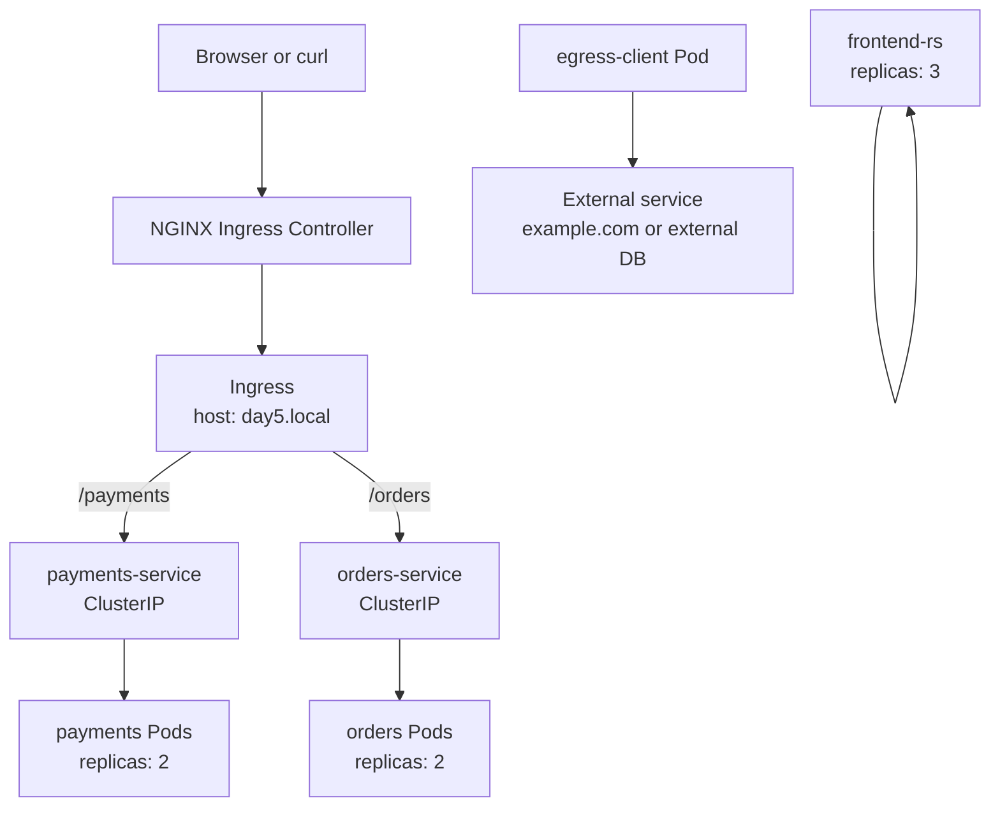

# Day 5 - Replicas, ReplicaSet, Ingress, Probes, And Helm

## Goal

Day 5 is a complete mini-project that connects workload availability, application exposure, health checks, traffic direction, and packaging.

By the end of this module, students should be able to:

- Explain `replicas` in a Kubernetes manifest.
- Explain what a ReplicaSet does.
- Understand the difference between replicas, ReplicaSet, and Deployment.
- Explain ingress traffic and egress traffic in simple terms.
- Create an Ingress resource for HTTP path-based routing.
- Understand why an Ingress controller is required.
- Add liveness and readiness probes to application containers.
- Understand what happens when readiness or liveness checks fail.
- Install Helm.
- Understand Helm chart structure.
- Install, list, upgrade, rollback, inspect history, and uninstall a Helm release.

## Project Name

```text
Day 5 Ecommerce Routing Project
```

The project contains two backend services:

```text
/payments ---> payments-service ---> payments Pods
/orders   ---> orders-service   ---> orders Pods
```

It also contains:

- A standalone ReplicaSet for frontend replica practice.
- Liveness and readiness probes on application Pods.
- An Ingress object for external HTTP routing.
- An egress test Pod for outbound traffic testing.
- A Helm chart version of the same project.

## Project Architecture



## File Structure

```text
day5/
|-- README.md
|-- manifests/
|   |-- 00-namespace.yaml
|   |-- 01-payments-deployment.yaml
|   |-- 02-payments-service.yaml
|   |-- 03-orders-deployment.yaml
|   |-- 04-orders-service.yaml
|   |-- 05-frontend-replicaset.yaml
|   |-- 06-ingress.yaml
|   |-- 07-egress-test-pod.yaml
|-- helm/
|   |-- day5-ecommerce/
|       |-- Chart.yaml
|       |-- values.yaml
|       |-- templates/
|           |-- _helpers.tpl
|           |-- namespace.yaml
|           |-- payments-deployment.yaml
|           |-- payments-service.yaml
|           |-- orders-deployment.yaml
|           |-- orders-service.yaml
|           |-- ingress.yaml
|           |-- NOTES.txt
```

## 1. Replicas

`replicas` means how many copies of a Pod should run.

Example:

```yaml
spec:
  replicas: 2
```

Simple meaning:

```text
Kubernetes should keep 2 Pods running for this application.
```

In this project:

```text
payments Deployment replicas: 2
orders Deployment replicas: 2
frontend ReplicaSet replicas: 3
```

Why replicas matter:

- More than one Pod improves availability.
- Traffic can be distributed across multiple Pods.
- If one Pod fails, Kubernetes can create a replacement.
- Applications can handle more users when more Pods are running.

Real-time example:

```text
If one payments Pod crashes, another payments Pod can still serve traffic.
Kubernetes creates a replacement to return to the desired replica count.
```

## 2. ReplicaSet

A ReplicaSet maintains a stable number of replicated Pods.

Simple meaning:

```text
ReplicaSet watches Pods and makes sure the required number of matching Pods are running.
```

Example:

```text
Desired replicas: 3
Running Pods: 2
ReplicaSet action: create 1 more Pod
```

ReplicaSet uses a selector to find Pods:

```yaml
selector:
  matchLabels:
    app: frontend
    tier: web
```

Pod template labels must match the selector:

```yaml
template:
  metadata:
    labels:
      app: frontend
      tier: web
```

Important:

```text
In real projects, we usually create Deployments instead of creating ReplicaSets directly.
Deployment manages ReplicaSets and gives rollout and rollback features.
```

## ReplicaSet Practical

Apply the namespace and ReplicaSet:

```powershell
kubectl apply -f day5/manifests/00-namespace.yaml
kubectl apply -f day5/manifests/05-frontend-replicaset.yaml
```

Check ReplicaSet:

```powershell
kubectl get rs -n day5
kubectl get pods -n day5 -l app=frontend -o wide
```

Delete one Pod:

```powershell
kubectl delete pod <frontend-pod-name> -n day5
```

Check again:

```powershell
kubectl get pods -n day5 -l app=frontend -o wide
```

Expected result:

```text
ReplicaSet creates a replacement Pod.
The frontend Pod count returns to 3.
```

## 3. Ingress And Egress

## Ingress Traffic

Ingress means traffic coming into a network, cluster, service, or application.

Examples:

```text
User browser ---> web application
Internet ---> Kubernetes application
Client ---> Apache or Tomcat server
```

In Kubernetes, `Ingress` is an API object used to manage external HTTP and HTTPS access to Services inside the cluster.

Simple meaning:

```text
Ingress gives routing rules for external traffic.
```

Example:

```text
http://day5.local/payments ---> payments-service
http://day5.local/orders   ---> orders-service
```

## Egress Traffic

Egress means traffic going out of a network, cluster, service, or application.

Examples:

```text
Pod ---> external database
Pod ---> payment gateway API
Pod ---> internet URL
Pod ---> AWS S3 endpoint
```

Simple meaning:

```text
Ingress is incoming traffic.
Egress is outgoing traffic.
```

Kubernetes has an `Ingress` API object for incoming HTTP/HTTPS routing. For egress, traffic normally leaves the Pod through cluster networking unless NetworkPolicy, firewall rules, service mesh, NAT gateway, or cloud networking controls it.

## 4. Ingress Controller And Ingress Resource

Ingress has two important parts:

| Part | Meaning |
| --- | --- |
| Ingress resource | YAML rule that defines host/path routing |
| Ingress controller | Actual running component that reads rules and routes traffic |

Important:

```text
Creating only an Ingress YAML is not enough.
An Ingress controller must be running in the cluster.
```

Common Ingress controllers:

- NGINX Ingress Controller
- HAProxy Ingress
- Traefik
- GCE Ingress Controller
- AWS Load Balancer Controller
- Azure Application Gateway Ingress Controller

Kubernetes Ingress API status:

```text
Ingress is stable, but the API is frozen.
For new advanced production designs, Kubernetes recommends Gateway API.
For beginner Kubernetes classes, Ingress is still important and widely used.
```

## 5. Correct Ingress YAML Rules

Important corrections:

- Use only one `ingressClassName` in one Ingress spec.
- `pathType` is case-sensitive. Use `Prefix`, not `prefix`.
- Every path must have a backend service.
- The service name must exist.
- The service port must match the Service port.
- In Minikube NGINX addon, use `ingressClassName: nginx`.

Correct example used in this project:

```yaml
apiVersion: networking.k8s.io/v1
kind: Ingress
metadata:
  name: ecommerce-ingress
  namespace: day5
  annotations:
    nginx.ingress.kubernetes.io/rewrite-target: /
spec:
  ingressClassName: nginx
  rules:
    - host: day5.local
      http:
        paths:
          - path: /payments
            pathType: Prefix
            backend:
              service:
                name: payments-service
                port:
                  number: 80
          - path: /orders
            pathType: Prefix
            backend:
              service:
                name: orders-service
                port:
                  number: 80
```

## Ingress Practical

Start Minikube:

```powershell
minikube start --driver=docker
```

Enable NGINX Ingress controller in Minikube:

```powershell
minikube addons enable ingress
```

Check Ingress controller Pods:

```powershell
kubectl get pods -n ingress-nginx
```

Apply application manifests:

```powershell
kubectl apply -f day5/manifests/00-namespace.yaml
kubectl apply -f day5/manifests/01-payments-deployment.yaml
kubectl apply -f day5/manifests/02-payments-service.yaml
kubectl apply -f day5/manifests/03-orders-deployment.yaml
kubectl apply -f day5/manifests/04-orders-service.yaml
kubectl apply -f day5/manifests/06-ingress.yaml
```

Wait for Pods:

```powershell
kubectl rollout status deployment/payments -n day5
kubectl rollout status deployment/orders -n day5
```

Check resources:

```powershell
kubectl get deploy,svc,ingress -n day5
kubectl describe ingress ecommerce-ingress -n day5
```

Get Minikube IP:

```powershell
minikube ip
```

Add host entry on Windows PowerShell as Administrator:

```powershell
notepad C:\Windows\System32\drivers\etc\hosts
```

Add this line, replacing the IP with your Minikube IP:

```text
<minikube-ip> day5.local
```

Example:

```text
192.168.49.2 day5.local
```

Test routes:

```powershell
Invoke-WebRequest -UseBasicParsing http://day5.local/payments
Invoke-WebRequest -UseBasicParsing http://day5.local/orders
```

Alternative test without changing hosts file:

```powershell
curl.exe --resolve day5.local:80:<minikube-ip> http://day5.local/payments
curl.exe --resolve day5.local:80:<minikube-ip> http://day5.local/orders
```

Expected:

```text
/payments returns Payments Service
/orders returns Orders Service
```

## 6. Probes

Kubernetes probes are checks performed by the kubelet.

Probes help Kubernetes decide:

- Is the container alive?
- Is the container ready to receive traffic?
- Should the container be restarted?
- Should the Pod receive Service traffic?

Main probes to teach first:

```text
1. Liveness probe
2. Readiness probe
```

Important note:

```text
Kubernetes also supports startupProbe.
Startup probe is useful for slow-starting applications.
For Day 5, focus mainly on liveness and readiness.
```

## Liveness Probe

Liveness probe checks whether the container is alive.

If liveness fails repeatedly:

```text
Kubernetes restarts the container.
```

Use case:

```text
Application process is running but stuck.
Application is not responding.
Container needs restart to recover.
```

Example:

```yaml
livenessProbe:
  httpGet:
    path: /
    port: http
  initialDelaySeconds: 15
  periodSeconds: 20
```

Meaning:

```text
After 15 seconds, kubelet checks / every 20 seconds.
If the check keeps failing, kubelet restarts the container.
```

## Readiness Probe

Readiness probe checks whether the application is ready to receive traffic.

If readiness fails:

```text
The Pod stays running, but it is removed from Service endpoints.
```

Use case:

```text
Application is starting.
Application is connected to database.
Application has loaded configuration.
Application is temporarily not ready for traffic.
```

Example:

```yaml
readinessProbe:
  httpGet:
    path: /
    port: http
  initialDelaySeconds: 5
  periodSeconds: 10
```

Meaning:

```text
After 5 seconds, kubelet checks / every 10 seconds.
If the check fails, Service does not send traffic to the Pod.
```

## Liveness Vs Readiness

| Probe | Checks | Failure Action |
| --- | --- | --- |
| Liveness | Is container alive? | Restart container |
| Readiness | Is app ready for traffic? | Remove Pod from Service endpoints |

Simple interview answer:

```text
Liveness decides restart.
Readiness decides traffic.
```

## Probe Practical

The payments and orders Deployments already include both probes.

Check probes:

```powershell
kubectl describe deployment payments -n day5
kubectl describe pod <payments-pod-name> -n day5
```

Check endpoints:

```powershell
kubectl get endpoints payments-service -n day5
kubectl get endpoints orders-service -n day5
```

If readiness fails, endpoints become empty or reduced.

Useful debugging commands:

```powershell
kubectl get pods -n day5
kubectl describe pod <pod-name> -n day5
kubectl logs <pod-name> -n day5
kubectl get events -n day5 --sort-by=.metadata.creationTimestamp
```

## 7. Egress Practical

Apply the egress test Pod:

```powershell
kubectl apply -f day5/manifests/07-egress-test-pod.yaml
```

Wait for it:

```powershell
kubectl get pod egress-client -n day5
```

Test outbound access:

```powershell
kubectl exec -n day5 egress-client -- wget -qO- http://example.com
```

Simple explanation:

```text
This is egress because traffic starts from inside the Pod and goes outside the cluster.
```

If this fails, common reasons are:

- No internet access from Minikube.
- DNS issue.
- Corporate proxy or firewall.
- NetworkPolicy blocks egress.

## 8. Helm

Helm is a package manager for Kubernetes.

Simple meaning:

```text
Helm packages Kubernetes YAML files into a reusable chart.
```

Without Helm:

```text
kubectl apply -f deployment.yaml
kubectl apply -f service.yaml
kubectl apply -f ingress.yaml
```

With Helm:

```text
helm install day5-web ./day5/helm/day5-ecommerce
```

Helm helps with:

- Packaging many YAML files together.
- Reusing templates.
- Managing environment-specific values.
- Installing an application as a release.
- Upgrading an application.
- Rolling back to a previous release.
- Uninstalling all resources created by a release.

## Helm Installation

Check Helm:

```powershell
helm version
```

Windows install using Winget:

```powershell
winget install Helm.Helm
```

Windows install using Chocolatey:

```powershell
choco install kubernetes-helm
```

Linux/macOS install from official script:

```bash
curl -fsSL -o get_helm.sh https://raw.githubusercontent.com/helm/helm/main/scripts/get-helm-4
chmod 700 get_helm.sh
./get_helm.sh
```

Note:

```text
Many older tutorials use get-helm-3 because Helm 3 was the standard for years.
Current Helm docs now show the get-helm-4 script. The basic commands are still familiar: create, install, list, history, upgrade, rollback, uninstall.
```

## Helm Chart Structure

This project includes:

```text
day5/helm/day5-ecommerce/
|-- Chart.yaml
|-- values.yaml
|-- templates/
|   |-- namespace.yaml
|   |-- payments-deployment.yaml
|   |-- payments-service.yaml
|   |-- orders-deployment.yaml
|   |-- orders-service.yaml
|   |-- ingress.yaml
|   |-- NOTES.txt
```

Important files:

| File | Purpose |
| --- | --- |
| Chart.yaml | Chart metadata such as name and version |
| values.yaml | Default configurable values |
| templates/ | Kubernetes YAML templates |
| NOTES.txt | Message shown after install |

## Helm Commands

Create a new chart:

```powershell
helm create <chart-name>
```

Render templates without installing:

```powershell
helm template day5-web day5/helm/day5-ecommerce
```

Install chart:

```powershell
helm install day5-web day5/helm/day5-ecommerce
```

List releases:

```powershell
helm list -n day5
helm list -A
```

Upgrade release:

```powershell
helm upgrade day5-web day5/helm/day5-ecommerce --set replicaCount=3
```

Check history:

```powershell
helm history day5-web -n day5
```

Rollback release:

```powershell
helm rollback day5-web 1 -n day5
```

Uninstall release:

```powershell
helm uninstall day5-web -n day5
```

## Helm Practical

Start from a clean namespace:

```powershell
kubectl delete namespace day5 --ignore-not-found=true
```

Render chart first:

```powershell
helm template day5-web day5/helm/day5-ecommerce
```

Install:

```powershell
helm install day5-web day5/helm/day5-ecommerce
```

Check resources:

```powershell
kubectl get all -n day5
kubectl get ingress -n day5
helm list -n day5
```

Upgrade replica count:

```powershell
helm upgrade day5-web day5/helm/day5-ecommerce --set replicaCount=3
```

Check Deployment replicas:

```powershell
kubectl get deployment -n day5
```

Check release history:

```powershell
helm history day5-web -n day5
```

Rollback:

```powershell
helm rollback day5-web 1 -n day5
```

Uninstall:

```powershell
helm uninstall day5-web -n day5
```

## Complete Day 5 Command Flow

```powershell
# Start cluster
minikube start --driver=docker

# Enable Ingress controller
minikube addons enable ingress
kubectl get pods -n ingress-nginx

# Apply raw manifests
kubectl apply -f day5/manifests/00-namespace.yaml
kubectl apply -f day5/manifests/01-payments-deployment.yaml
kubectl apply -f day5/manifests/02-payments-service.yaml
kubectl apply -f day5/manifests/03-orders-deployment.yaml
kubectl apply -f day5/manifests/04-orders-service.yaml
kubectl apply -f day5/manifests/05-frontend-replicaset.yaml
kubectl apply -f day5/manifests/06-ingress.yaml
kubectl apply -f day5/manifests/07-egress-test-pod.yaml

# Validate workloads
kubectl get all -n day5
kubectl get ingress -n day5
kubectl get endpoints -n day5
kubectl describe ingress ecommerce-ingress -n day5

# ReplicaSet self-healing
kubectl get pods -n day5 -l app=frontend
kubectl delete pod <frontend-pod-name> -n day5
kubectl get pods -n day5 -l app=frontend

# Ingress testing
minikube ip
curl.exe --resolve day5.local:80:<minikube-ip> http://day5.local/payments
curl.exe --resolve day5.local:80:<minikube-ip> http://day5.local/orders

# Egress testing
kubectl exec -n day5 egress-client -- wget -qO- http://example.com

# Helm rendering and install
helm template day5-web day5/helm/day5-ecommerce
helm install day5-web day5/helm/day5-ecommerce
helm list -n day5
helm upgrade day5-web day5/helm/day5-ecommerce --set replicaCount=3
helm history day5-web -n day5
helm rollback day5-web 1 -n day5
helm uninstall day5-web -n day5
```

## Troubleshooting

### Ingress Does Not Work

Check controller:

```powershell
kubectl get pods -n ingress-nginx
```

Check Ingress:

```powershell
kubectl describe ingress ecommerce-ingress -n day5
```

Check Services:

```powershell
kubectl get svc -n day5
kubectl get endpoints -n day5
```

Common causes:

- Ingress controller is not installed.
- `ingressClassName` is wrong.
- Host file entry is missing.
- Service name in Ingress backend is wrong.
- Service has no endpoints because Pods are not ready.

### Ingress YAML Error

Check for these issues:

```text
Only one ingressClassName is allowed.
pathType should be Prefix, not prefix.
Each path must have backend.service.name and backend.service.port.number.
Indentation must be correct.
```

### Pods Are Running But Service Has No Endpoints

Check Pod labels:

```powershell
kubectl get pods -n day5 --show-labels
```

Check Service selector:

```powershell
kubectl describe svc payments-service -n day5
```

The selector must match Pod labels.

### Readiness Probe Fails

Check Pod events:

```powershell
kubectl describe pod <pod-name> -n day5
```

Check application path:

```powershell
kubectl exec -n day5 <pod-name> -- wget -qO- http://127.0.0.1/
```

If readiness fails, the Pod is removed from Service endpoints.

### Liveness Probe Fails

Check restarts:

```powershell
kubectl get pods -n day5
kubectl describe pod <pod-name> -n day5
```

If liveness fails repeatedly, Kubernetes restarts the container.

### Helm Command Not Found

Install Helm:

```powershell
winget install Helm.Helm
```

Then reopen PowerShell and run:

```powershell
helm version
```

### Helm Install Fails Because Resources Already Exist

If you already applied raw manifests, clean them first:

```powershell
kubectl delete namespace day5 --ignore-not-found=true
```

Then install with Helm:

```powershell
helm install day5-web day5/helm/day5-ecommerce
```

## Cleanup

Delete raw manifest resources:

```powershell
kubectl delete namespace day5 --ignore-not-found=true
```

If installed with Helm:

```powershell
helm uninstall day5-web -n day5
kubectl delete namespace day5 --ignore-not-found=true
```

Optional: disable Minikube Ingress addon:

```powershell
minikube addons disable ingress
```

Stop Minikube:

```powershell
minikube stop
```

## Interview Questions

### What is replicas in Kubernetes?

`replicas` defines how many Pod copies Kubernetes should keep running.

### What is a ReplicaSet?

A ReplicaSet ensures that a stable number of matching Pods are running.

### Difference between ReplicaSet and Deployment?

ReplicaSet maintains Pod count. Deployment manages ReplicaSets and provides rolling update, rollback, and rollout history.

### What is ingress traffic?

Ingress is traffic coming into a service, network, cluster, or application.

### What is egress traffic?

Egress is traffic going out from a service, network, cluster, or application.

### What is Kubernetes Ingress?

Ingress is a Kubernetes API object that defines HTTP and HTTPS routing rules from outside the cluster to Services inside the cluster.

### Is Ingress enough by itself?

No. An Ingress controller must be installed and running. The Ingress resource only defines rules.

### What is an Ingress controller?

An Ingress controller watches Ingress resources and configures the actual proxy or load balancer that routes incoming traffic.

### What is liveness probe?

A liveness probe checks whether a container is alive. If it fails repeatedly, Kubernetes restarts the container.

### What is readiness probe?

A readiness probe checks whether the application is ready to receive traffic. If it fails, the Pod is removed from Service endpoints.

### Liveness vs readiness?

Liveness decides whether to restart the container. Readiness decides whether the Pod should receive traffic.

### What is Helm?

Helm is a Kubernetes package manager used to package, install, upgrade, rollback, and uninstall Kubernetes applications.

### What is a Helm chart?

A Helm chart is a package containing Kubernetes templates, default values, and metadata.

### What is a Helm release?

A release is an installed instance of a Helm chart in a Kubernetes cluster.

## Class Teaching Flow

Use this order in tomorrow's class:

```text
1. Explain replicas using a simple Deployment example.
2. Explain ReplicaSet self-healing.
3. Explain ingress and egress with real traffic examples.
4. Explain Ingress resource vs Ingress controller.
5. Apply payments and orders Deployments and Services.
6. Apply Ingress and test /payments and /orders.
7. Explain liveness and readiness probes from the same manifests.
8. Run egress test from a Pod.
9. Explain Helm as Kubernetes package manager.
10. Render and install the same project using Helm.
11. Show helm list, upgrade, history, rollback, and uninstall.
```


## Local Validation

Validation performed without starting Minikube, so no Pods were created or left running.

```text
Minikube status: Stopped
Raw Kubernetes manifest YAML: parsed successfully, 8 files
Helm Chart.yaml and values.yaml: parsed successfully
Helm CLI: not installed locally, so helm template was not executed on this machine
```

Before tomorrow's live demo, install Helm and run:

```powershell
helm version
helm template day5-web day5/helm/day5-ecommerce
```

## Official References

- Kubernetes Ingress: https://kubernetes.io/docs/concepts/services-networking/ingress/
- Kubernetes Ingress Controllers: https://kubernetes.io/docs/concepts/services-networking/ingress-controllers/
- Kubernetes Probes: https://kubernetes.io/docs/tasks/configure-pod-container/configure-liveness-readiness-startup-probes/
- Helm installation: https://helm.sh/docs/intro/install/
- Helm create: https://helm.sh/docs/helm/helm_create/
- Helm install: https://helm.sh/docs/helm/helm_install/
- Helm history: https://helm.sh/docs/helm/helm_history/

